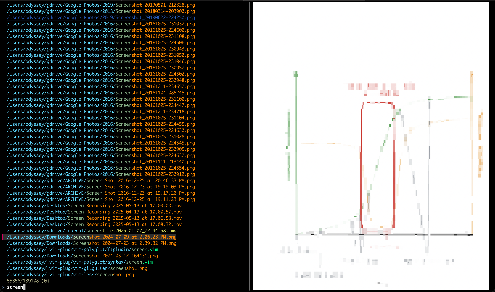

cmdk
====


The ⌘-k "access anything" shortcut is awesome on Notion, Slack, etc.

The terminal, by comparison, is a dinosaur: tons of repeated `cd` and `ls` and `TAB` just to get anywhere.

This is ⌘-k for the terminal: access anything on your filesystem, from anywhere, with previews before you open:




When you press enter, the type of selected files are identified and...

- Directories get `cd`d to
- Text files get opened in the command of your [`$EDITOR` variable](https://bash.cyberciti.biz/guide/$EDITOR_variable) (or `vim -O` if it's unset)
- Images and PDFs get opened in the Preview app
- `.key` files get opened in Keynote

_I'm extremely grateful to [fzf](https://github.com/junegunn/fzf); this project wouldn't be possible without it. I'd been fed up with terminal navigation for a decade, and fzf was the missing piece needed to make cmdk possible._

Installation
------------
1. Install `cmdk` and dependencies:
   ```sh
   # NOTE: 'bat', 'tiv', and 'poppler' are optional: for previewing text, image, and PDF files respectively
   brew install fzf fd bat tiv poppler
   ```
2. ```sh
   git clone git@github.com:mieubrisse/cmdk.git ~/.cmdk
   ```
3. Add to your `.zshrc` or `.bashrc`:
   ```sh
   source ~/.cmdk/cmdk.sh   # This will make a 'cmdk' function available in your shell
   ```
4. (Optional) Bind the `⌘-k` hotkey (or any other if you prefer) to send the text `cmdk\n` in your terminal
   <details>
   <summary>iTerm</summary>
   `Settings → Profiles → Keys → Keybindings → + → Send Text`, then binding `⌘-k` to send the text `cmdk\n`
   </details>
   <details>
   <summary>Ghostty</summary>
   ```
   # ~/.config/ghostty/config   (or $XDG_CONFIG_HOME/ghostty/config)
   keybind = cmd+k=text:cmdk\r
   ```
   </details>
5. Open a new shell and press your hotkey (⌘-K if you bound it) or enter `cmdk` (if you don't have a hotkey)

Usage
-----
Press ⌘-k (or type `cmdk`) and...

- Type to start filtering
  > 💡 If you're trying to get a directory, add a `/` to the end of your search term. E.g. `down/` will pull up the `Downloads` directory
- `Ctrl-j` and `Ctrl-k` to scroll up and down the results list
- `ENTER` to select the result
- `TAB` to select multiple items before `ENTER`
- `Ctrl-u` to clear the selection

> ⚠️ Some directories like `Library`, `/`, and `.git` are full of stuff users don't need to access, so their contents are excluded. To get to their contents, first ⌘-k to them and then ⌘-k again to see their contents.

> 💡 Sometimes you only want to jump to the contents of the current directory. This can be done by calling `cmdk -o`. I've set up a separate iTerm hotkey for this: `⌘-l` to send `cmdk -o\n`.

Feedback
--------
Hi HN! I'd love to hear how you're using cmdk, and making it your own.

TODO
----
- [Allow customizing the program used to open files](https://github.com/mieubrisse/cmdk/issues/4)
- [Allow for favoriting files that pop to the top of the search](https://github.com/mieubrisse/cmdk/issues/5)
- [Store the results of a selection in the history](https://github.com/mieubrisse/cmdk/issues/1)
