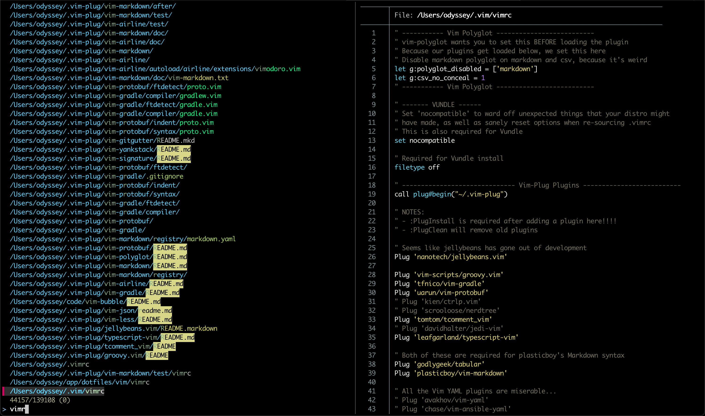

cmdk
====
The ⌘-k "access anything" shortcut is amazing on Notion, Slack, etc.

The terminal sucks: typing tons of `cd`s and `TAB`s just to get anything done.

This is ⌘-k for the terminal: access anything on your filesystem, from anywhere.



Based on what you choose...

- Directories get `cd`d to
- Text files get opened in Vim
- Images and PDFs get opened in the Preview app
- `.key` files get opened in Keynote

Of course, you get previews of each item (including images) before you select.

_**Huge** thanks to [fzf](https://github.com/junegunn/fzf). I've been fed up with terminal navigation for a decade, and discovering fzf was the last piece needed to make this project possible._

Installation
------------
1. ```sh
   brew install fzf fd bat tiv
   ```
2. ```sh
   git clone git@github.com:mieubrisse/cmdk.git ~/.cmdk
   ```
3. Add to your `.zshrc` or `.bashrc`:
   ```sh
   source ~/.cmdk/cmdk.sh
   ```
4. Bind the `⌘-k` hotkey to enter the string `cmdk\n` in your terminal
   > 💡 In iTerm, this is done with `Settings → Profiles → Keys → Keybindings → + → Send Text`, then binding `⌘-k` to send the text `cmdk\n`

Usage Tips
----------
- You can also select multiple items with `TAB` before pressing enter
- Some directories like `Library` and `/` and `.git` are full of stuff users don't need to access, so their contents are excluded. To jump around their contents, first ⌘-k to them and then ⌘-k again to see their contents.
- You can clear the search text with `Ctrl-u`
