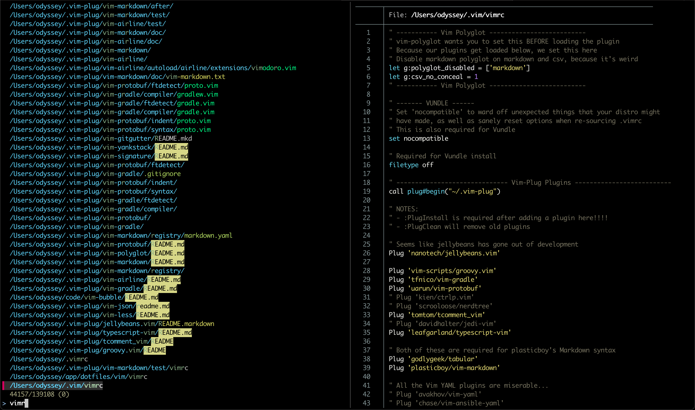
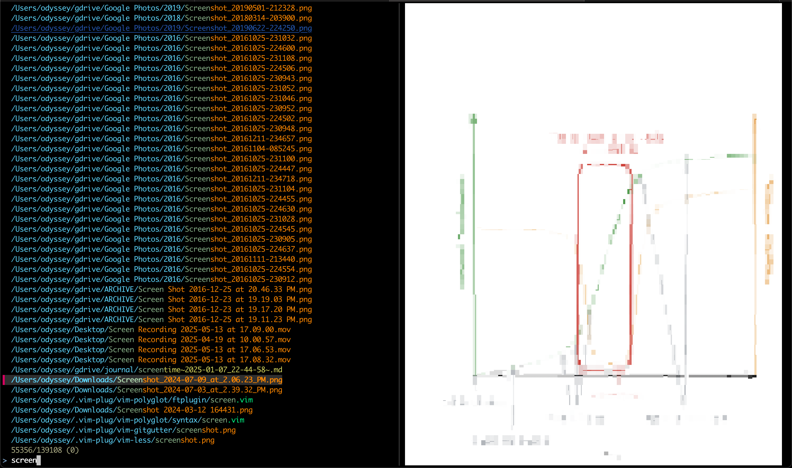

cmdk
====


The ⌘-k "access anything" shortcut is awesome on Notion, Slack, etc.

The terminal, by comparison, is a dinosaur: tons of repeated `cd` and `ls` and `TAB` just to get anywhere.

This is ⌘-k for the terminal: access anything on your filesystem, from anywhere, with previews before you open:





When you press enter, the type of selected files are identified and...

- Directories get `cd`d to
- Text files get opened in the command of your [`$EDITOR` variable](https://bash.cyberciti.biz/guide/$EDITOR_variable) (or `vim -O` if it's unset)
- Images and PDFs get opened in the Preview app
- `.key` files get opened in Keynote

_I'm extremely grateful to [fzf](https://github.com/junegunn/fzf); this project wouldn't be possible without it. I'd been fed up with terminal navigation for a decade, and fzf was the missing piece needed to make cmdk possible._

Installation
------------
1. Install dependencies:
   ```sh
   # Required
   brew install fzf fd

   # Optional: for previewing text, image, and PDF files respectively
   brew install bat tiv poppler
   ```
2. Install Go (1.21+) and build `cmdk`:
   ```sh
   brew install go
   git clone https://github.com/mieubrisse/cmdk.git ~/.cmdk
   cd ~/.cmdk/go
   make build
   ```
   This produces the `cmdk` binary at `~/.cmdk/go/cmdk`.
3. Add the binary to your `PATH` and source the shell integration. In your `.zshrc` or `.bashrc`:
   ```sh
   export PATH="${HOME}/.cmdk/go:${PATH}"
   eval "$(cmdk init)"
   ```
   Or if you're on `fish`, in your `~/.config/fish/config.fish`:
   ```fish
   fish_add_path ~/.cmdk/go
   cmdk init | source
   ```
4. (Optional) Bind the `⌘-k` hotkey (or any other if you prefer) to send the text `cmdk\n` in your terminal:
   <details>
   <summary>iTerm</summary>

   `Settings → Profiles → Keys → Keybindings → + → Send Text`, then binding `⌘-k` to send the text `cmdk\n`

   </details>
   <details>
   <summary>Ghostty</summary>

   ```
   # ~/.config/ghostty/config  (or $XDG_CONFIG_HOME/ghostty/config)
   keybind = cmd+k=text:cmdk\r
   ```

   </details>
5. Open a new shell and press your hotkey (⌘-K if you bound it) or type `cmdk`

Usage
-----
Press ⌘-k (or type `cmdk`) and...

- Type to start filtering
  > If you're trying to get a directory, add a `/` to the end of your search term. E.g. `down/` will pull up the `Downloads` directory
- `Ctrl-j` and `Ctrl-k` to scroll up and down the results list
- `ENTER` to select the result
- `TAB` to select multiple items before `ENTER`
- `Ctrl-u` to clear the selection

> Some directories like `Library`, `/`, and `.git` are full of stuff users don't need to access, so their contents are excluded. To get to their contents, first ⌘-k to them and then ⌘-k again to see their contents.

> Sometimes you only want to jump to the contents of the current directory. This can be done by calling `cmdk -o` to list **o**nly the contents of the current directory (no recursing) or `cmdk -s` to list **s**ubdirectories (recursing). I've set up separate iTerm hotkeys: `⌘-k` to send `cmdk\n`, and `⌘-shift-k` for `cmdk -s\n`.

### Command-line flags

- `-o` - Only list the contents of the current directory at depth 1
- `-s` - List all contents of the current directory recursively, including subdirectories

Building from source
--------------------
```sh
cd go/
make build    # produces ./cmdk
make clean    # removes the binary
```

Or without Make:
```sh
cd go/
go build -o cmdk .
```

Feedback
--------
I'd love to hear how you're using cmdk, and making it your own.

TODO
----
- [Allow customizing the program used to open files](https://github.com/mieubrisse/cmdk/issues/4)
- [Allow for favoriting files that pop to the top of the search](https://github.com/mieubrisse/cmdk/issues/5)
- [Store the results of a selection in the history](https://github.com/mieubrisse/cmdk/issues/1)
